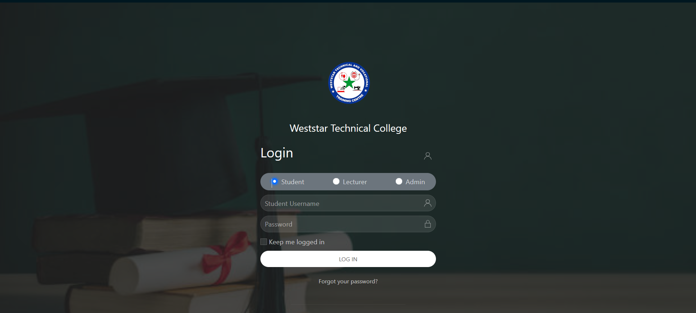

# School Management System  

This **School Management System** is a comprehensive platform designed to streamline and manage school operations efficiently. The system includes features for administrators, teachers, students, and parents, providing a unified solution for school management.  

🔗 **Live Demo:** [Check it out here](https://schoolmanagement.photosoko.com/)  

## Features

## 🏫 Administrator Dashboard  
- Manage student, teacher, and parent profiles.  
- Oversee class schedules and assignments.  
- Generate reports and analytics for school performance.  

**Test Credentials:**  
- **Username:** `Admin Test`  
- **Password:** `111111`  

## 📚 Teacher Portal  
- Manage class rosters and attendance.  
- Assign and grade homework and exams.  
- View detailed performance reports for each student.  

**Test Credentials:**  
- **Username:** `Lecturer Test`  
- **Password:** `111111`  

## 🎓 Student Portal  
- View class schedules and upcoming events.  
- Submit assignments and track grades.  
- Communicate with teachers.  

**Test Credentials:**  
- **Username:** `Student Test`  
- **Password:** `111111`  


### 📊 Reports & Analytics

- Student performance insights.
- Attendance tracking.
- Teacher efficiency reports.

## Technologies Used

- **Backend:** Node.js, Javascript, Mongoose
- **Frontend:** Ejs, Javascript, Css
- **Database:** MongoDB

## Setup Instructions

1. Clone the repository:
   ```bash
   git clone https://github.com/ElvisKemoi/Wester-Technical-College.git
   ```
2. Navigate to the project directory:
   ```bash
   cd Wester-Technical-College
   ```
3. Install dependencies:
   ```bash
   npm install
   ```
4. Configure the environment variables in `.env` file.
5. Start the development server:
   ```bash
   npm start
   ```

## Screenshots

### Admin Dashboard


### Teacher Portal


### Student Portal


### Login



## Contributions

Contributions are welcome! Please fork the repository and submit a pull request.

## License

[MIT License](LICENSE)
